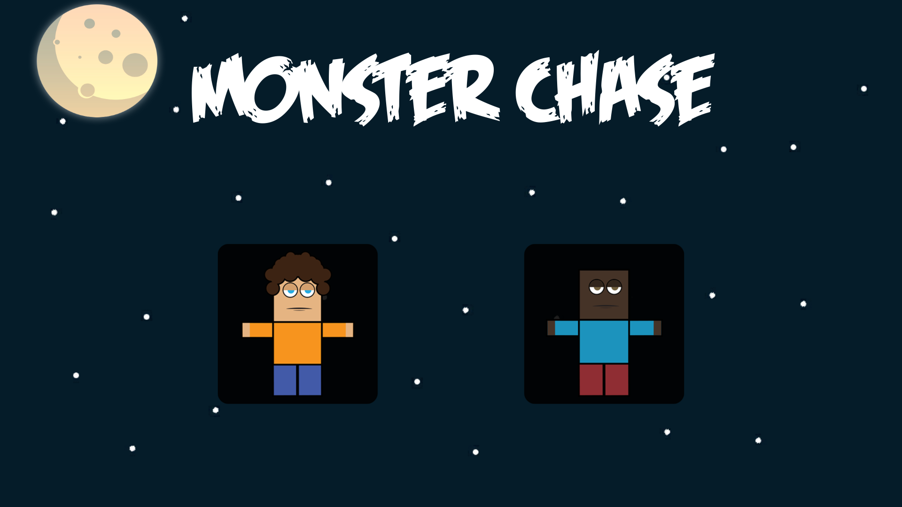

# MonsterChase
MonsterChase is an exhilarating and action-packed 2D game developed using Unity engine and programmed in C#.

## Implementations 
- Basic movement system, which involves collision and jumping 
- Player destroyed on collision with monster
- Random monster spawn speed
- Sound effects
